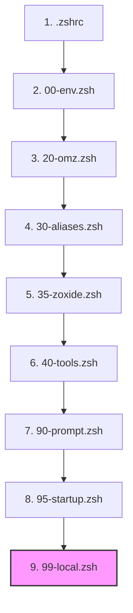
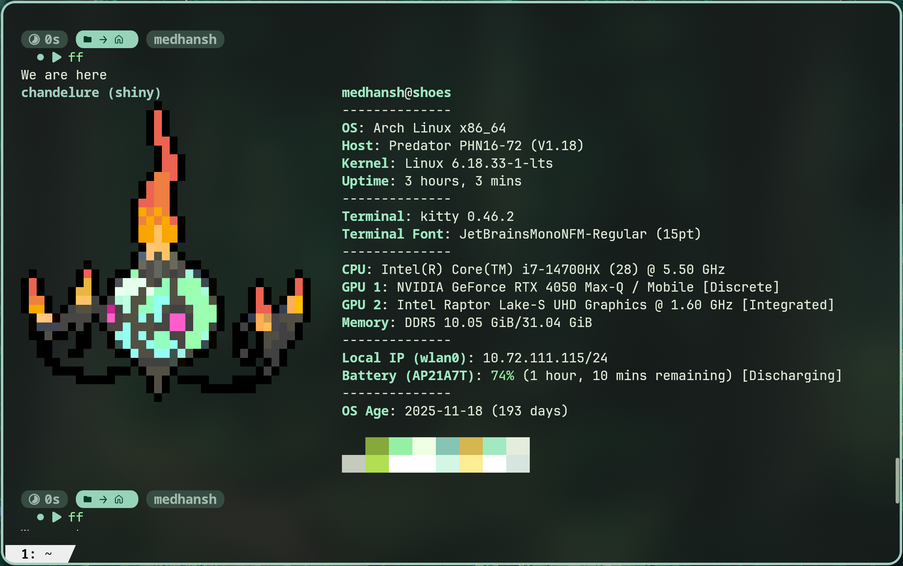
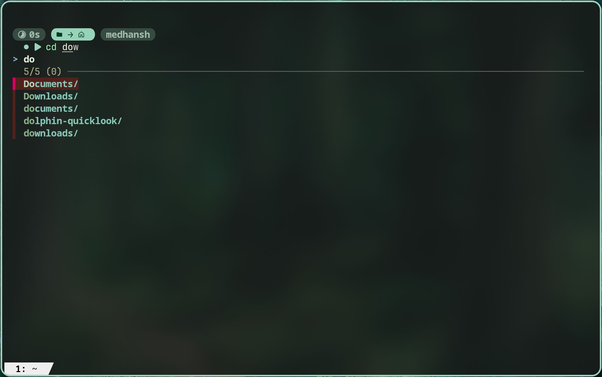
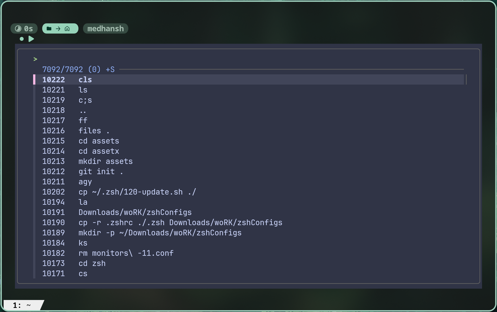
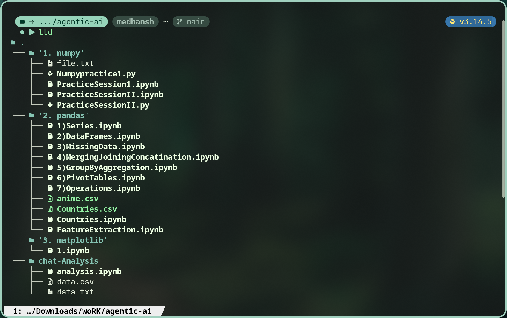

# Portable, Modular Zsh Dotfiles

[](https://www.zsh.org/)
A modular Zsh configuration built around fast startup times, sensible organization, and long-term maintainability.

---
## Why This Exists (Philosophy)

I wanted to share my `zshrc` with the world.

I've been maintaining my dotfiles on GitHub for a while, and this repository is one part of that collection. The main reason for creating a separate repository was to focus on my shell configuration, since the terminal is where I spend most of my time. Keeping it isolated also makes it easier to maintain, improve, and share.

Originally, everything lived inside a single `.zshrc` file. As I added more aliases, functions, integrations, and customizations, the configuration quickly grew and became difficult to navigate and maintain. To solve that problem, I reorganized everything into a modular structure - which I later post-rationalized as an attempt to escape "monolithic bloat."

This repository follows a **modular, numbered approach**:

* **Separation of Concerns:** Each module has a specific responsibility. Aliases, environment variables, tool integrations, and machine-specific settings all live in their own dedicated files.
* **Load Order Control:** Modules are sourced using a predictable numbering system. `00-` modules establish the environment, while higher-numbered modules build on top of it, with `99-` reserved for local overrides.
* **Cleaner Portability:** Machine-specific settings can be isolated, disabled, or replaced without affecting the rest of the configuration, making it easier to move between systems.
* **Maintainability:** Adding new functionality is as simple as dropping a new module into the appropriate place instead of expanding a single monolithic configuration file.
---
## Quick Start
```bash
# Clone and copy
git clone git@github.com:MedhanshOO7/.zshrc.git ~/zshConfigs
cp -ri ~/zshConfigs/.zshrc ~/.zshrc
cp -ri ~/zshConfigs/.zsh ~/.zsh
```
--- 
## Prerequisites & Dependencies

To take full advantage of this configuration, you should have **Zsh >= 5.8** installed.
### Tested Environment
- OS: Arch Linux
- Shell: Zsh 5.9+
- Terminal: Kitty
- WM/Compositor: Hyprland
- Prompt: Starship
- Plugin Manager: Oh My Zsh


### Dependency Audit & Official Packages

| Dependency       | Purpose                                                | Target               | Status       | Homepage / Link                                                                  |
| :--------------- | :----------------------------------------------------- | :------------------- | :----------- | :------------------------------------------------------------------------------- |
| **Oh My Zsh**    | Shell plugin framework                                 | Core Shell           | **Required** | [ohmyz.sh](https://ohmyz.sh/)                                                    |
| **Starship**     | Fast, cross-shell prompt                               | Prompt               | **Required** | [starship.rs](https://starship.rs/)                                              |
| **eza**          | Modern directory listing (`ls` replacement)            | Aesthetics           | **Required** | [eza.rocks](https://eza.rocks/)                                                  |
| **bat**          | Syntax-highlighting file previewer (`cat` replacement) | Aliases/Previews     | **Required** | [github.com/sharkdp/bat](https://github.com/sharkdp/bat)                         |
| **zoxide**       | Fast directory jumps (`cd` replacement)                | Navigation           | **Required** | [github.com/ajeetdsouza/zoxide](https://github.com/ajeetdsouza/zoxide)           |
| **fzf**          | Command line fuzzy finder                              | Autocomplete/History | **Required** | [github.com/junegunn/fzf](https://github.com/junegunn/fzf)                       |
| **wl-clipboard** | Wayland command line copy/paste                        | Clipboard            | Optional     | [github.com/bugaevc/wl-clipboard](https://github.com/bugaevc/wl-clipboard)       |
| **yt-dlp**       | Command-line video and audio downloader                | Downloader           | Optional     | [github.com/yt-dlp/yt-dlp](https://github.com/yt-dlp/yt-dlp)                     |
| **fastfetch**    | Modern system informational fetch                      | Diagnostics          | Optional     | [github.com/fastfetch-cli/fastfetch](https://github.com/fastfetch-cli/fastfetch) |
| **Neovim**       | Advanced text editor (Pager/Editor default)            | Core Editing         | Optional     | [neovim.io](https://neovim.io/)                                                  |
| **ImageMagick**  | Image processing tool (used for color matching)        | Scripting            | Optional     | [imagemagick.org](https://imagemagick.org/)                                      |
| **jq**           | Command line JSON processor                            | Scripting            | Optional     | [jqlang.github.io/jq](https://jqlang.github.io/jq)                               |
| **Zenity**       | GUI dialog script engine (for updates)                 | GUI Update           | Optional     | [wiki.gnome.org/Projects/Zenity](https://wiki.gnome.org/Projects/Zenity)         |
| **libnotify**    | Desktop notifications (via `notify-send`)              | Notifications        | Optional     | [gitlab.gnome.org/GNOME/libnotify](https://gitlab.gnome.org/GNOME/libnotify)     |

---

### 💻 Installation Commands

Choose the block corresponding to your package manager:

#### Arch Linux (`pacman` / `yay`)
```bash
# Core package installations
sudo pacman -S zsh git eza bat zoxide fzf starship neovim yt-dlp fastfetch wl-clipboard jq imagemagick python python-pip cargo zenity libnotify

# AUR fallback if needed for special helper components
# yay -S <packages>
```

#### Fedora (`dnf`)
```bash
# Install core packages (Starship is not in official repositories)
sudo dnf install zsh git eza bat zoxide fzf neovim yt-dlp fastfetch wl-clipboard jq ImageMagick python3 python3-pip cargo zenity libnotify
```

*Note: To install Starship on Fedora, run the official installer: `curl -sS https://starship.rs/install.sh | sh`*

#### Debian / Ubuntu (`apt`)
```bash
sudo apt update
sudo apt install zsh git bat fzf neovim yt-dlp wl-clipboard jq imagemagick python3 python3-pip cargo zenity libnotify-bin
```

*Note: Depending on your Debian/Ubuntu release version, newer tools like `eza`, `zoxide`, `fastfetch`, and `starship` might not be in standard apt repos. You can install them via their official standalone curl/installation binaries:*

```bash
# Starship:
curl -sS https://starship.rs/install.sh | sh

# Zoxide:
curl -sSfL https://raw.githubusercontent.com/ajeetdsouza/zoxide/main/install.sh | sh

# Fastfetch & Eza can be compiled via cargo or grabbed from their GitHub Release page:
cargo install eza
```

#### macOS (`Homebrew`)
```bash
brew install git eza bat zoxide fzf starship neovim yt-dlp fastfetch jq imagemagick python3
```

---

## File Structure

```
zshConfigs/
├── .zshrc                    # Main entry point; loads modular configurations in order
├── README.md                 # Project documentation
├── PERSONAL_FLAGS.md         # Detailed audit of user-specific configurations
├── install.sh                # Automation script to set up symlinks
└── .zsh/                     # Shell module directory
    ├── 00-env.zsh            # Path definitions, fzf previews, & core environment
    ├── 10-instant.zsh        # Instant prompt setup for Powerlevel10k theme
    ├── 20-omz.zsh            # Oh My Zsh plugin lists & main sourcing
    ├── 30-aliases.zsh        # Command shorthand (navigation, yt-dlp, update aliases)
    ├── 35-zoxide.zsh         # Zoxide CD integrations
    ├── 40-tools.zsh          # Utility functions (mkcd, search, git shortcut commits)
    ├── 90-prompt.zsh         # Starship theme integration
    ├── 95-startup.zsh        # Placeholder startup script
    ├── 99-local.zsh          # Gitignored local override configuration template
    ├── 100-setting.zsh       # Acer Predator keyboard & fan profiles (hardware-specific)
    ├── 120-update.sh         # Standalone system updater shell script (CLI/GUI)
    ├── kb-wallpaper.sh       # Backlight RGB-to-wallpaper synchronization script
    └── monitors-11.conf      # Empty display/monitor layout config placeholder
```

| File                    | Purpose                              | Portability                                           |
| :---------------------- | :----------------------------------- | :---------------------------------------------------- |
| `.zshrc`                | Root startup initialization script   | **Portable** (Abstracted)                             |
| `.zsh/00-env.zsh`       | Core environment configurations      | **Portable**                                          |
| `.zsh/10-instant.zsh`   | P10K speed-up prompt logic           | **Portable**                                          |
| `.zsh/20-omz.zsh`       | Active plugins list                  | **Portable**                                          |
| `.zsh/30-aliases.zsh`   | Shorthand commands                   | **Mostly Portable** (contains minor personal aliases) |
| `.zsh/35-zoxide.zsh`    | Directory navigation integration     | **Portable**                                          |
| `.zsh/40-tools.zsh`     | Core script utilities & widgets      | **Mostly Portable** (contains Arch pacman installers) |
| `.zsh/90-prompt.zsh`    | Evaluates prompt configurations      | **Portable**                                          |
| `.zsh/95-startup.zsh`   | Custom shell entry scripts           | **Portable**                                          |
| `.zsh/99-local.zsh`     | Local override settings              | **Local only** (gitignored)                           |
| `.zsh/100-setting.zsh`  | Acer Predator hardware controller    | **Hardware Specific** (Acer Predator Only)            |
| `.zsh/120-update.sh`    | Arch Linux updating utility          | **Distro Specific** (Arch Only)                       |
| `.zsh/kb-wallpaper.sh`  | Keyboard RGB wallpaper match utility | **Hardware Specific** (Faustus driver Only)           |
| `.zsh/monitors-11.conf` | Display configuration placeholder    | **Local Only**                                        |

---

## Sourcing & Startup Sequence
When you open an interactive Zsh terminal, the files are sourced in the following order:



*Note: Sourced files skip `10-instant.zsh` since it runs instantly at compilation level (if active). Additionally, `100-setting.zsh` is only sourced by `30-aliases.zsh` if the Acer Predator kernel module is detected (`/sys/module/linuwu_sense`).*

---

## Installation

### Oh My Zsh Setup
Ensure you have Oh My Zsh and the required plugins cloned first

|Dependency|Purpose|Status|
|---|---|---|
|zsh-autosuggestions|Fish-style suggestions|Required|
|zsh-syntax-highlighting|Command highlighting|Required|
|fzf-tab|Fuzzy tab completion|Required|

```bash
# Install Oh My Zsh
sh -c "$(curl -fsSL https://raw.githubusercontent.com/ohmyzsh/ohmyzsh/master/tools/install.sh)"

# Clone plugin dependencies
git clone https://github.com/zsh-users/zsh-autosuggestions ${ZSH_CUSTOM:-~/.oh-my-zsh/custom}/plugins/zsh-autosuggestions
git clone https://github.com/zsh-users/zsh-syntax-highlighting.git ${ZSH_CUSTOM:-~/.oh-my-zsh/custom}/plugins/zsh-syntax-highlighting
git clone https://github.com/Aloxaf/fzf-tab ${ZSH_CUSTOM:-~/.oh-my-zsh/custom}/plugins/fzf-tab
```

### Applying the Configuration
You can install these configuration files either via symlinking (recommended for easy git pulls) or by copying the files directly to your home directory.

#### Method A: Symlinking (Recommended)
```bash
# Clone the repository
git clone https://github.com/your-username/zshConfigs.git ~/zshConfigs
cd ~/zshConfigs

# Run the install script (will back up and symlink automatically)
chmod +x install.sh
./install.sh
```

#### Method B: Copying
```bash
# Clone and copy
git clone https://github.com/your-username/zshConfigs.git ~/zshConfigs
cp -r ~/zshConfigs/.zshrc ~/.zshrc
cp -r ~/zshConfigs/.zsh ~/.zsh
```

### First Run
When you reload the shell for the first time (`exec zsh`), `starship` will initialize your prompt. If you haven't installed a Nerd Font, some symbols might look broken. We recommend using a font such as **FiraCode Nerd Font** or **JetBrainsMono Nerd Font** in your terminal application.

---

## Customization & Numbering System

The configs in `.zsh/` are loaded sequentially:
- **`00` - `09`**: Environment, core systems, path setup, and terminal configurations.
- **`10` - `19`**: Instant prompt and fast startup configurations.
- **`20` - `29`**: Oh My Zsh plugin lists and settings.
- **`30` - `39`**: User aliases and basic path abbreviations.
- **`40` - `89`**: Utilities, terminal keybindings, custom Zle widgets, and scripts.
- **`90` - `98`**: Prompts and startup outputs.
- **`99`**: Local overrides (gitignored).

### Adding Custom Modules
To add a new configuration section, create a file inside `.zsh/` matching the format `##-name.zsh` (e.g. `.zsh/50-python.zsh`) and append its name inside your `.zshrc` modular load loop:
```zsh
# inside ~/.zshrc

for file in \
    00-env \
    20-omz \
    30-aliases \
    35-zoxide \
    40-tools \
    # your new module
    50-python \
    90-prompt \
    95-startup \
    99-local
do
	source "$HOME/.zsh/${file}.zsh"
done
```

### Local Overrides (`99-local.zsh`)
For personal tokens, path adjustments, or work-specific scripts that should never be made public, copy the template `.zsh/99-local.zsh` and populate it. It is tracked by `.gitignore` and will never be pushed.

---

## Hardware & Personal Config Warning

Some files in this configuration are customized for specific hardware profiles and will throw errors or behave unexpectedly on standard Unix systems:
- `.zsh/100-setting.zsh`: Hardware presets for custom Acer Predator fan and power controllers.
- `.zsh/kb-wallpaper.sh`: Keyboard zone backlight syncing matching specific hardware layouts.
- `.zsh/120-update.sh`: Arch Linux-specific GUI and CLI updating tool.

For a comprehensive list of every personal variable, username reference, and hardware dependency found in this configuration, please consult the **[PERSONAL_FLAGS.md](PERSONAL_FLAGS.md)** file inside this directory.

---

## Screenshots

### Overview
System information and overall terminal appearance.



### Smart Tab Completion
Directory navigation and completion powered by Zsh and fzf-tab.



### Fuzzy History Search
Reverse history search using fzf.



### Command Suggestions
Fish-style command suggestions via zsh-autosuggestions.


### Language-Aware Prompt
Starship automatically displaying the active Python version.



---
## License

MIT License
